# Gestão de Estoque – Pavimor

## Descrição do Projeto

Este projeto foi desenvolvido como parte de um **projeto acadêmico de extensão**, no qual tive a oportunidade de criar um sistema para a Pavimor, uma microempresa que fabrica e monta calçadas, pisos intertravados e produtos similares.

A proposta do projeto é implementar um **CRUD completo (Create, Read, Update e Delete)** para auxiliar no controle e na gestão de estoque. Durante o desenvolvimento, algumas soluções específicas foram pesquisadas em documentação e fóruns, como expressões regulares para validação de campos e pequenas funcionalidades de formatação de valores monetários.

O projeto também foi alinhado aos **Objetivos de Desenvolvimento Sustentável (ODS) da ONU**, com foco em:

* **ODS 8 – Trabalho decente e crescimento econômico** (meta 8.2 – produtividade e inovação).
* **ODS 9 – Indústria, inovação e infraestrutura** (meta 9.5 – inovação tecnológica em pequenas empresas).

Os dados utilizados no sistema são **meramente ilustrativos**, não representando informações reais da empresa.

---

## Funcionalidades

Trata-se de um sistema de **gestão de estoque com interface gráfica**, permitindo:

* Inserção de produtos.
* Visualização de registros.
* Atualização de dados.
* Exclusão de produtos.
* Registro de saída de materiais.

---

## Telas e Comportamento do Sistema

A aplicação inicia com uma **tela principal**, contendo uma mensagem de boas-vindas e botões para cada operação: Inserir (I), Visualizar (V), Atualizar (A), Excluir (E) e Registrar Saída (R).
Cada botão possui uma **cor associada à sua ação**, reforçando a percepção de risco ou impacto da operação.

O projeto foi pensado com noções básicas de **UX/UI**, buscando facilitar o uso do sistema. Além do uso do mouse, é possível navegar pelo aplicativo utilizando apenas o teclado, digitando letras correspondentes às ações. O sistema também apresenta mensagens de ajuda, alertas e validações visuais para reduzir erros de uso.

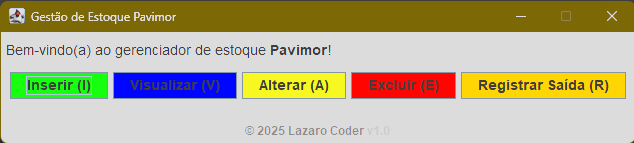

### Inserir Produto

Tela destinada ao cadastro de novos produtos, contendo campos de nome, unidade de medida, localização, quantidade e custo unitário.
Campos numéricos possuem validação por expressões regulares, e menus suspensos são utilizados para evitar erros de preenchimento.
O sistema valida se todos os campos estão corretos antes de permitir a inserção no banco.

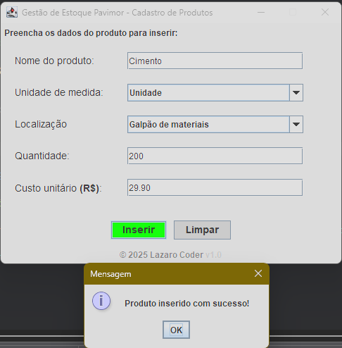

### Visualizar Produtos

Exibe os produtos cadastrados em formato de tabela, com destaque visual para:

* Produtos com estoque baixo.
* Produtos com estoque zerado.
* Data de saída, quando aplicável.

Filtros visuais auxiliam a identificação rápida da situação do estoque.


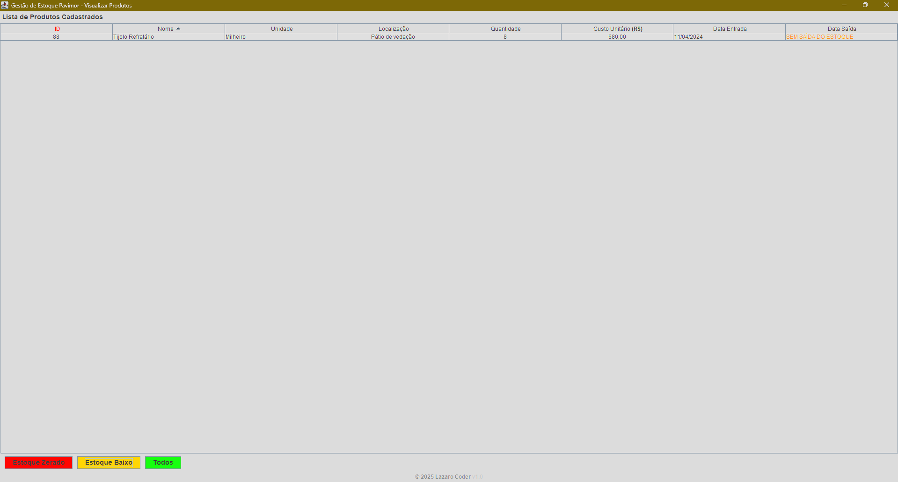

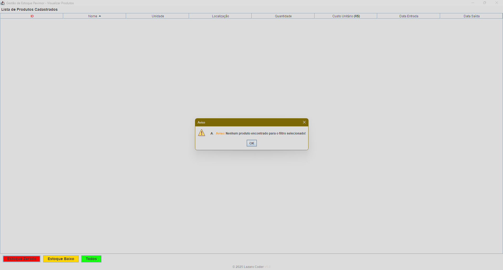

### Atualizar Produtos

Permite alterar informações de um produto a partir do seu ID.
Os campos permanecem desativados até que um ID válido seja informado e buscado. Caso nenhuma alteração seja feita, o sistema informa que não houve mudanças.

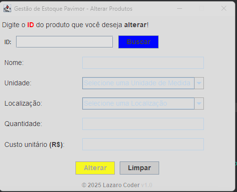

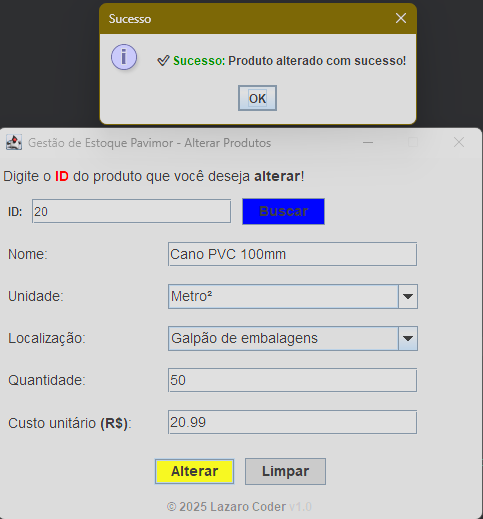

### Excluir Produtos

Tela destinada à exclusão definitiva de registros.
A operação exige confirmação explícita do usuário, reduzindo o risco de perda acidental de dados.

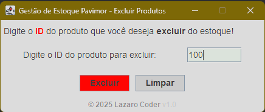

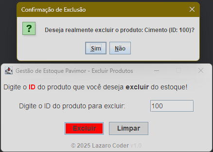

### Registrar Saída

Responsável por dar baixa no estoque conforme o uso dos materiais.
O sistema valida a quantidade disponível, impede remoções superiores ao estoque atual e exibe mensagens claras em caso de erro.

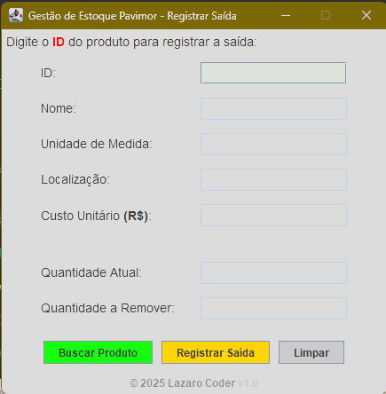

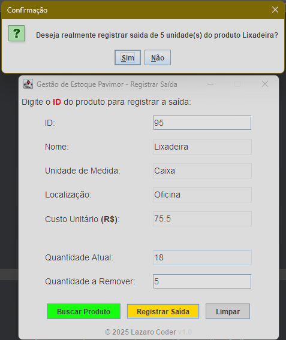

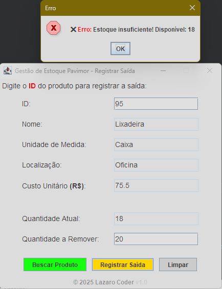

---

## Fluxo CRUD

As telas da aplicação se comunicam com a camada de acesso a dados (**DAO**), que utiliza um **DTO (Produto)** para transportar informações.
A conexão com o banco de dados é centralizada na classe responsável pela conexão.
Cada operação (inserir, listar, atualizar, remover e registrar saída) possui métodos específicos no DAO, com tratamento de exceções adequado.

---

## Validações e Tratamento de Erros

O sistema possui validações para:

* Campos obrigatórios.
* Limite de caracteres.
* Campos numéricos inválidos.
* IDs inexistentes.
* Estoque insuficiente.

Mensagens de erro e sucesso são exibidas ao usuário de forma clara, além de mensagens de apoio durante o uso das telas.
Na camada de banco de dados, exceções são tratadas e registradas no console para facilitar o desenvolvimento e manutenção.

---

## Tecnologias Utilizadas

* Java
* Java Swing
* MySQL
* Expressões regulares simples para validação de campos
* IDE recomendada: Eclipse

---

## Como Executar o Projeto

1. Clone o repositório:

   ```
   git clone https://github.com/lazaronpj/gestaoEstoquePavimor.git
   ```
2. Abra o projeto em sua IDE Java.
3. Instale e inicie o MySQL.
4. Crie o banco de dados e a tabela conforme o script disponível no repositório na pasta <b>script</b>.
5. Execute a classe principal `Tela.java`.

---

## Estrutura do Projeto

* conexaoBD: conexão com o banco de dados
* dao: acesso e manipulação dos dados
* model: classe Produto (DTO)
* util: validações auxiliares
* view: telas da aplicação (inserir, visualizar, atualizar, excluir e registrar saída)

---

## Aprendizados

Este projeto contribuiu significativamente para meu desenvolvimento prático em:

* CRUD com banco de dados.
* Java Swing.
* Organização em camadas (view, model e DAO).
* Validação de dados e tratamento de erros.

Foi uma experiência importante por envolver um **cenário real**, ainda que em contexto acadêmico, permitindo aplicar conceitos de engenharia de software e usabilidade.

---

## Estado Atual do Projeto

Projeto funcional e praticamente finalizado, com pequenos ajustes planejados.

---

## Possíveis Melhorias Futuras

* Melhorar a formatação de valores monetários.
* Centralizar mensagens de alerta e validações.
* Criar filtros mais avançados de visualização.
* Aprimorar regras de validação em telas específicas.
* Bloqueio preventivo de ações inválidas na interface.

---

## Observação Final

Este projeto tem como objetivo resolver um problema prático de controle de estoque, ao mesmo tempo em que serve como instrumento de aprendizado e evolução técnica.
Apesar de ser um sistema simples, ele demonstra conceitos fundamentais de desenvolvimento de software, organização de código e preocupação com usabilidade.

Meu foco é o **aprendizado contínuo**, e este projeto representa uma etapa importante dessa trajetória.


